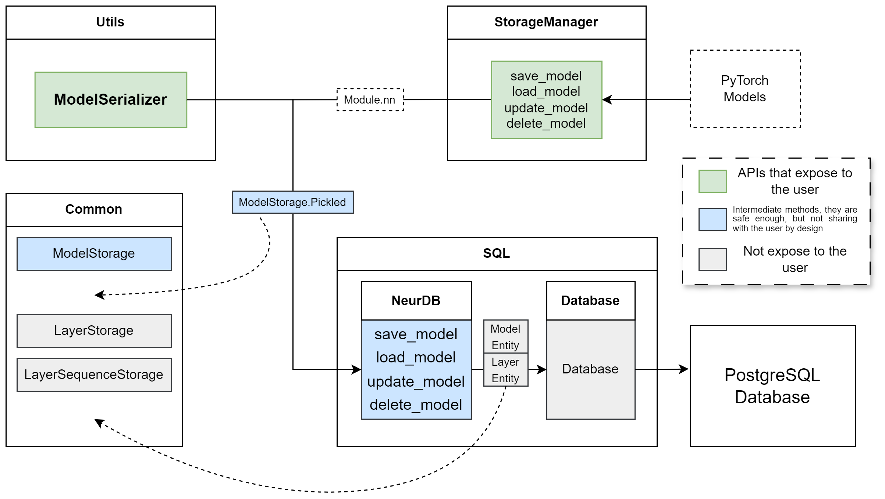

# NeurDB Python API - Storage Manager
The Storage Manager is a module that manages the storage of the data in the database. It is responsible for the saving, loading, modification, and deletion of the model in the database. The overall structure of the Storage Manager is shown below:

## API
The APIs provided by the Storage Manager are as shown below.

| Function                                                     | Description                                                  |
| ------------------------------------------------------------ | ------------------------------------------------------------ |
| `ModelSerializer.serialize_model(model: torch.nn.Model) -> ModelStorage.Pickled` | Serialize a `torch.nn.Model` into a `ModelStorage.Pickled` object. |
| `ModelSerializer.deserialize_model(model_pickled: ModelStorage.Pickled) -> torch.nn.Module` | Deserialize a `ModelStorage.Pickled` object into a `torch.nn.Model`. |
| `NeurDB(db_name: str, db_user: str, db_host: str, db_port: str) -> NeurDB` | Creates a `NeurDB` object to interact with the database. Defaults are taken from `Configuration.py` under the `storage_manager.config` package. You can specify values when creating the object or modify global parameters in `Configuration.py`. |
| `neurdb_object.save_model(model_storage_pickle: ModelStorage.Pickled) -> int` | Save a model to the database. The model's id will be returned. Layer-level storage is handled within this method. |
| `neurdb_object.load_model(model_id: int) -> ModelStorage.Pickled` | Loads a model from the database using its ID.                |
| `neurdb_object.update_model(model_id: int, layer_id: int, layer_data: bytes) -> None` | Updates a specific layer of the model. The `layer_id` defaults to the layer's sequence in the model, starting from 0. |
| `neurdb_object.delete_model(model_id: int) -> None`          | Delete a model from the database. This will delete all versions of its layers as well. |

## Usage
Refer to [model_serialize.ipynb](../example/model_serialize.ipynb), and [model_storage.ipynb](../example/model_storage.ipynb) for usage demonstration.

## Table Schema
The table schema for the storage manager is as shown below:

| Table Name | Description                                                  | Columns                                                      |
| ---------- | ------------------------------------------------------------ | ------------------------------------------------------------ |
| `model`    | Stores the model's metadata.                                 | `model_id` (int, primary key), `model_meta` (bytea) |
| `layer`    | Stores the model's layers.                                   | `model_id` (int, foreign key), `layer_id` (int), `create_time` (timestamp), `layer_data` (bytea) |
